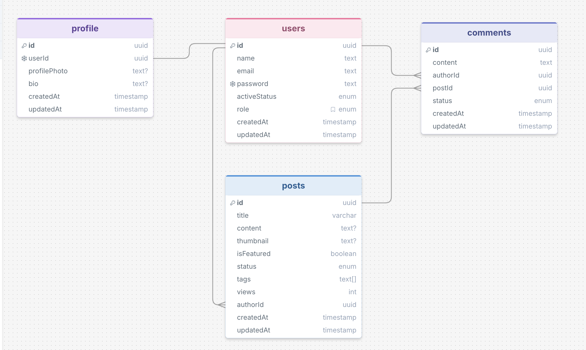

# Prisma Blog API

A production-style RESTful Blog Backend API built with **Express.js**, **TypeScript**, **Prisma ORM**, and **PostgreSQL**.

This project was primarily built to deepen my understanding of **Prisma ORM**, database design, authentication, authorization, and scalable backend architecture.

---

## 🚀 Features

### 🔐 Authentication & Authorization
- User Registration
- User Login
- JWT Access Token
- JWT Refresh Token
- HTTP-Only Cookies
- Role-Based Access Control (RBAC)

### 👤 User Management
- Get Logged-in User Profile
- Update User Profile
- User & Admin Roles

### 📝 Posts
- Create Post
- Update Post
- Delete Post
- Get Single Post
- Get My Posts
- Search Posts
- Filter Posts
- Pagination & Sorting
- View Count Tracking
- Post Statistics Dashboard

### 💬 Comments
- Create Comment
- Update Comment
- Delete Comment
- Get Comment Details
- Get Comments by Author
- Comment Moderation (Admin)

### 🛡️ Security & Error Handling
- Password Hashing with bcrypt
- JWT Authentication
- Protected Routes
- Global Error Handling
- Prisma Error Handling
- Custom Response Utility
- CORS Configuration

---

# 🏗️ Tech Stack

| Technology    | Purpose               |
|---------------|-----------------------|
| Node.js       | Runtime Environment   |
| Express.js    | Web Framework         |
| TypeScript    | Programming Language  |
| Prisma ORM    | Database ORM          |
| PostgreSQL    | Database              |
| JWT           | Authentication        |
| bcryptjs      | Password Hashing      |
| Cookie Parser | Cookie Management     |
| CORS          | Cross-Origin Requests |

---

# 🏛️ Architecture

This project follows a modular layered architecture:

```text
Route
   ↓
Controller
   ↓
Service
   ↓
Prisma ORM
   ↓
PostgreSQL
```

---

# 📁 Project Structure

```bash
prisma-blog-api
├── generated/
│
├── prisma/
│   ├── migrations/
│   └── schema/
│       ├── comment.prisma
│       ├── enums.prisma
│       ├── post.prisma
│       ├── profile.prisma
│       ├── schema.prisma
│       └── user.prisma
│
├── src/
│   ├── config/
│   │   └── index.ts
│   │
│   ├── lib/
│   │   └── prisma.ts
│   │
│   ├── middlewares/
│   │   ├── auth.ts
│   │   ├── globalErrorHandler.ts
│   │   └── notFound.ts
│   │
│   ├── modules/
│   │   ├── auth/
│   │   │   ├── auth.controller.ts
│   │   │   ├── auth.interface.ts
│   │   │   ├── auth.route.ts
│   │   │   └── auth.service.ts
│   │   │
│   │   ├── comment/
│   │   │   ├── comment.controller.ts
│   │   │   ├── comment.interface.ts
│   │   │   ├── comment.route.ts
│   │   │   └── comment.service.ts
│   │   │
│   │   ├── post/
│   │   │   ├── post.controller.ts
│   │   │   ├── post.interface.ts
│   │   │   ├── post.route.ts
│   │   │   └── post.service.ts
│   │   │
│   │   └── user/
│   │       ├── user.controller.ts
│   │       ├── user.interface.ts
│   │       ├── user.route.ts
│   │       └── user.service.ts
│   │
│   ├── utils/
│   │   ├── catchAsync.ts
│   │   ├── jwt.ts
│   │   └── sendResponse.ts
│   │
│   ├── app.ts
│   └── server.ts
│
├── .env
├── .env.example
├── .gitignore
├── package.json
├── package-lock.json
├── prisma.config.ts
└── tsconfig.json
```

---


## Database Design

The following ERD illustrates the relationships between Users, Profiles, Posts, and Comments.



---

# ⚙️ Installation

## Clone the Repository

```bash 
git clone https://github.com/Zobaida-Jim/Prisma-Blog-API
cd prisma-blog-api
```

## Install Dependencies

Using npm:

```bash
npm install
```

Using pnpm:

```bash
pnpm install
```

---

# 🔐 Environment Variables

Create a `.env` file in the root directory. Add variables according to `.env.example`

---

# 🗄️ Database Setup

Generate Prisma Client:

```bash
npx prisma generate
```

Run Migrations:

```bash
npx prisma migrate dev
```

Open Prisma Studio:

```bash
npx prisma studio
```

---

# ▶️ Running the Application

Development Mode:

```bash
npm run dev
```

---

# 🌐 API Base URL

```text
http://localhost:8080/api
```

---

# 📌 API Endpoints

## 🔐 Authentication

| Method  | Endpoint              |
|---------|-----------------------|
| POST    | `/auth/login`         |
| POST    | `/auth/refresh-token` |

---

## 👤 Users

| Method  | Endpoint            |
|---------|---------------------|
| POST    | `/users/register`   |
| GET     | `/users/me`         |
| PUT     | `/users/my-profile` |

---

## 📝 Posts

| Method  | Endpoint         |
|---------|------------------|
| GET     | `/posts`         |
| GET     | `/posts/stats`   |
| GET     | `/posts/my-posts`|
| GET     | `/posts/:postId` |
| POST    | `/posts`         |
| PATCH   | `/posts/:postId` |
| DELETE  | `/posts/:postId` |

---

## 💬 Comments

| Method  | Endpoint                        |
|---------|---------------------------------|
| GET     | `/comments/:commentId`          |
| GET     | `/comments/author/:authorId`    |
| POST    | `/comments`                     |
| PATCH   | `/comments/:commentId`          |
| DELETE  | `/comments/:commentId`          |
| PATCH   | `/comments/:commentId/moderate` |

---

# 🔎 Query Parameters

### Posts Endpoint

```http
GET /posts
```

Supported Query Parameters:

| Parameter  | Description             |
|------------|-------------------------|
| search     | Search by title/content |
| tags       | Filter by tags          |
| isFeatured | Filter featured posts   |
| status     | Filter by status        |
| authorId   | Filter by author        |
| page       | Pagination page         |
| limit      | Number of items         |
| sortBy     | Sort field              |
| sortOrder  | asc / desc              |

Example:

```http
GET /posts?search=prisma&page=1&limit=10&sortBy=createdAt&sortOrder=desc
```

---

# 📮 Postman Collection

A Postman collection is included in the root directory of this project named Prisma-Blog-API.postman_collection.json

To test the API:

1. Clone or download this repository.
2. Open Postman.
3. Click **Import**.
4. Select the `Prisma-Blog-API.postman_collection.json` file from the project's root directory.

The collection contains pre-configured requests for:

- Authentication
- Users
- Posts
- Comments

> **Note:** Before testing the APIs, make sure to configure the required environment variables and start the server locally.
```

---

# 📊 Database Schema

### User
- id
- name
- email
- password
- role
- activeStatus

### Profile
- profilePhoto
- bio

### Post
- title
- content
- thumbnail
- tags
- status
- views
- isFeatured

### Comment
- content
- status

---

# 🎯 Learning Objectives

This project helped me practice:

- Prisma ORM
- Database Relationships
- Authentication & Authorization
- JWT & Refresh Token Flow
- Modular Backend Architecture
- REST API Design
- Pagination & Filtering
- Error Handling
- TypeScript Best Practices
- PostgreSQL Integration

---

# 👨‍💻 Author

**Zobaida Jim**
